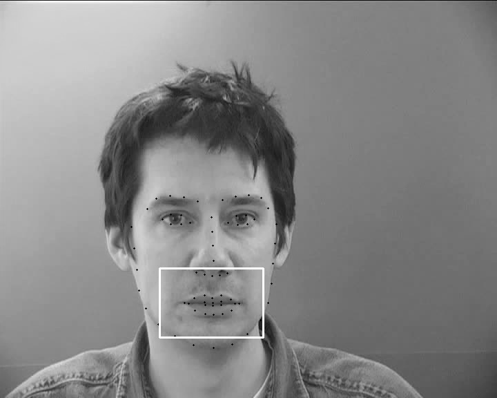

# LipNet - Lipreading System with Automatic Lip ROI Extraction

This repository is a fork of the **LipNet** implementation by [**Nicholas Renotte**](https://github.com/nicknochnack).
[Watch his tutorial on YouTube](https://www.youtube.com/watch?v=uKyojQjbx4c&t=1453s)

## Added features

1. **Automatic Face Tracking**:
   - Utilizes **dlib's facial landmark detector** to locate and track faces in video frames.
  

2. **ROI Extraction for Lips**:
   - Extracts a dynamic Region of Interest (ROI) around the lips from the detected facial landmarks.

3. **Tracked Videos Caching**
   - Extracted ROIs are cached to avoid reruning dlib tracking during data loading.

## Example of calculated landmarks and ROI

 (http://spandh.dcs.shef.ac.uk/gridcorpus)

